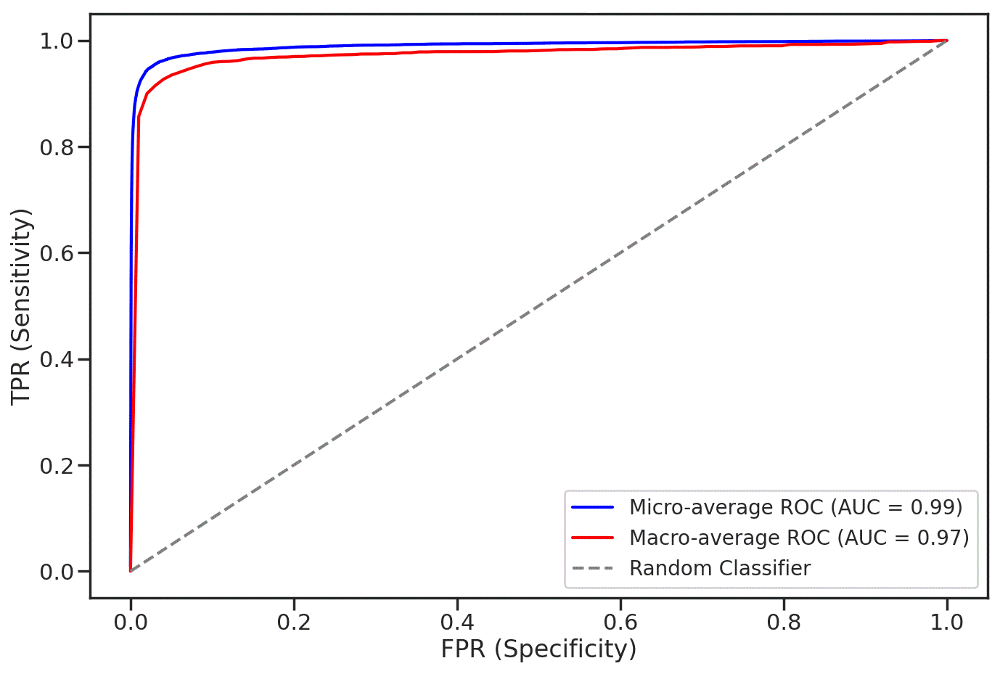

# Domain-Adaptive Pre-training of Self-Supervised Foundation Models for Medical Image Classification in Gastrointestinal Endoscopy


**Authors:** Marcel Roth, Micha V. Nowak, Dr. Adrian Krenzer, Prof. Dr. Frank Puppe

```
@article{roth2024domain,
  title={Domain-Adaptive Pre-training of Self-Supervised Foundation Models for Medical Image Classification in Gastrointestinal Endoscopy},
  author={Marcel Roth, Micha V. Nowak, Dr. Adrian Krenzer, Prof. Dr. Frank Puppe},
  journal={arXiv preprint arXiv:XXXXXXX},
  year={2024}
}
```

## Abstract
Video capsule endoscopy has transformed gastrointestinal endoscopy (GIE) diagnostics by offering a non-invasive method for capturing detailed images of the gastrointestinal tract, enabling early disease detection. However, its potential is limited by the sheer volume of images generated during the imaging procedure, which can take anywhere from 6-8 hours and often produce up to 1 million images, necessitating automated analysis. Additionally, the variability of these images, combined with the need for expert annotations and the scarcity of large, high-quality labeled datasets, constrains the effectiveness of current medical image analysis models. To address this, we introduce a novel large gastrointestinal endoscopy dataset, called EndoExtend24, created by merging and re-stratifying the train/test splits of ten existing public and private datasets, ensuring no overlap of patient data across splits. EndoExtend24 includes over 226,000 labeled images, as well as dynamic class mappings, which allow unified training across datasets with differing labeling granularity, supporting up to 123 distinct pathological findings. Further, we propose to leverage domain adaptive pre-training of foundation models in computer vision trained with self-supervision on generic image data, to adapt them to the task of GIE medical diagnosis. Specifically, the EVA-02 model, which is based on the vision transformer architecture and was trained on ImageNet-22k with masked image modeling (using EVA-CLIP as a MIM teacher), is pre-trained on the novel EndoExtend24 dataset to achieve domain adaptation, and finally trained on the Capsule Endoscopy 2024 Challenge dataset. Experimental results show promising results on the challenge validation set, with an AUC Macro score of **0.993** and a balanced accuracy of **89.3%**.

---

# EndoExtend24
We introduce **EndoExtend24**, a large-scale,
multi-class GIE dataset comprising over 226,000 labeled images sourced from ten public and private datasets. EndoExtend24 is designed to support deep learning research in GIE by overcoming issues related to _data scarcity_, _inconsistent terminology standards_, _data leakage_ and _split flexibility_. Dataset characteristics are as follows:

<p align="center">
   
</p>

For the **Capsule Endoscopy 2024 Challenge**, we leveraged our flexible class mapping feature and created a specific **EndoExtend24** subset for our pre-training. This subset includes approximately 130,000 labeled images across 10 classes. The additional **EndoExtend24** dataset significantly increases the number of samples in the `bleeding`, `ulcer`, and `polyp` classes. Moreover, we added 201 samples to the rare `worms` class, sourced from the ERS dataset.

<p align="center">
   
</p>

## Evaluation Results
We report the following results:

<table style="width:100%; border-collapse: collapse;">
  <caption style="caption-side: top; font-weight: bold;">
    Performance of our final eva02-base model after pre-training and on the final downstream task of training on CE24, compared to our best baseline model during pre-training and to the baseline results reported for various architectures by the CE24 team. Accuracy (Acc) refers to the balanced accuracy, F1, AUC, and mAP are reported as macro average.
  </caption>
  <thead>
    <tr>
      <th></th>
      <th>Model</th>
      <th>Acc</th>
      <th>AUC</th>
      <th>F1</th>
      <th>mAP</th>
    </tr>
  </thead>
  <tbody>
    <tr>
      <td rowspan="2"><strong>Pre-Training</strong></td>
      <td>eva02-base</td>
      <td><strong><span style="color: red">0.810</span></strong></td>
      <td><strong>0.976</strong></td>
      <td><strong>0.786</strong></td>
      <td><strong>0.860</strong></td>
    </tr>
    <tr>
      <td>SEER</td>
      <td>0.743</td>
      <td>0.960</td>
      <td>0.723</td>
      <td>0.755</td>
    </tr>
    <tr>
      <td rowspan="5"><strong>Downstream</strong></td>
      <td>eva02-base <em>(ours)</em></td>
      <td><strong>0.893</strong></td>
      <td><strong>0.993</strong></td>
      <td><strong>0.875</strong></td>
      <td><strong>0.931</strong></td>
    </tr>
    <tr>
      <td>VGG16</td>
      <td>0.568</td>
      <td>0.916</td>
      <td>0.484</td>
      <td>0.525</td>
    </tr>
    <tr>
      <td>SVM</td>
      <td>0.410</td>
      <td>0.940</td>
      <td>0.490</td>
      <td>N/A</td>
    </tr>
    <tr>
      <td>ResNet50</td>
      <td>0.320</td>
      <td>0.871</td>
      <td>0.370</td>
      <td>N/A</td>
    </tr>
    <tr>
      <td>Custom CNN</td>
      <td>0.100</td>
      <td>N/A</td>
      <td>0.090</td>
      <td>N/A</td>
    </tr>
  </tbody>
</table>


<p align="center">
   
</p>
<p align="center">
   
</p>
<p align="center">
   
</p>


## Usage

1. Create a Virtual Environment with Python 3.11 via ```python3.11 -m venv venv``` and activate
   it ```source venv/bin/activate```
2. Install pytorch 2.4.0+cu121
   via ```pip3 install torch torchvision torchaudio --index-url https://download.pytorch.org/whl/cu121```
3. Install required packages with `pip install -r requirements.txt`
4. Download the Capsule Vision Challenge
   2024 [dataset](https://github.com/misahub2023/Capsule-Vision-2024-Challenge?tab=readme-ov-file) from the official
   GitHub repository, store it in `data/` **in the repository root** and make sure to have the following structure:
   ```
    data/
    ├── capsulevision/
    │   ├── training/
    │   │   ├── Angioectasia/
    │   │   │   ├── KID/
    │   │   │   │   ├── angioectasia-P0-1.jpg
    │   │   │   │   ├── ...
    │   │   │   ├── KVASIR/
    │   │   │   │   ├── 04a78ef00c5245e0_888.jpg
    │   │   │   │   ├── ...
    │   │   │   ├── SEE-AI/
    │   │   │   │   ├── image00279.jpg
    │   │   │   │   ├── ...   
    │   ├── validation/
    │   │   ├── ...
    │   ├── testing/
    │   │   ├── Images
    │   │   │   ├── 00Z0Xo99wp.jpg
    │   │   │   ├── ...
   ```
5. Download the pre-trained EndoExtend24 model weights via link/command and store them in `pretrained_models/` **in the
   repository root**
6. Make sure that your **repository root** is structured as follows:

```
.
├── configs/
├── data/
├── datasets/
│   ├── ce24/
│   │   ├── class_mapping.json
│   │   ├── train_val.csv
│   │   ├── test.csv
├── pretrained_models/
│   ├── eva02_base_patch14_224.pt_ee24.ckpt
│   ├── eva02_base_patch14_224.ee24_ft_ce24.ckpt   
├── src/
├── README.md
├── requirements.txt
├── infer.py
├── train.py
├── ...
```

7. Run `python train.py --config configs/submission/run_eva02_base_patch14_224.ee24_ft_ce24.yaml` to start fine-tuning
   the pre-trained EndoExtend24 model.

## Inference on the Test Set

## Model Weights

You can find the weights for both the pre-trained model and the fine-tuned downstream task model below. For an easy
download on a bash cluster such as a slurm master, you can use the `gdown` command as shown below.

| **Type**    | **Dataset**  | **Checkpoint**                                                                                                            | **Command**                               |
|-------------|--------------|---------------------------------------------------------------------------------------------------------------------------|-------------------------------------------|
| Pre-trained | EndoExtend24 | [eva02_base_patch14_224.pt_ee24](https://drive.google.com/file/d/1Ok58RCRvKdq1_VcFn35FQOHyznvq8JFr/view?usp=sharing)      | `gdown 1Ok58RCRvKdq1_VcFn35FQOHyznvq8JFr` |
| Fine-tuned  | CE24         | [eva02_base_patch14_224.ee24_ft_ce24](https://drive.google.com/file/d/123TjuBw-34bKXBu7njzKjbcObNXsnuEY/view?usp=sharing) | `gdown 123TjuBw-34bKXBu7njzKjbcObNXsnuEY` |

## Introduction
