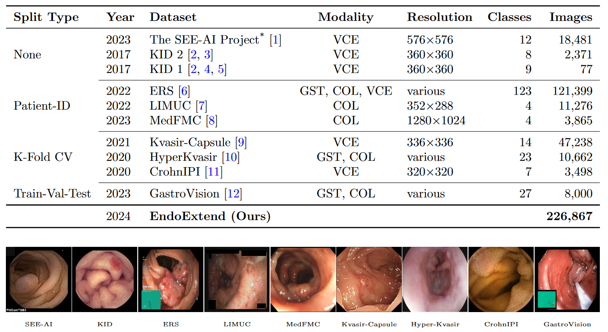
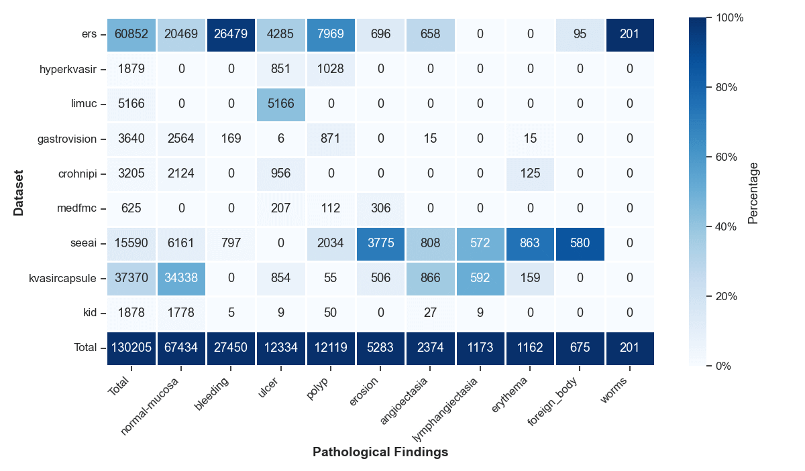
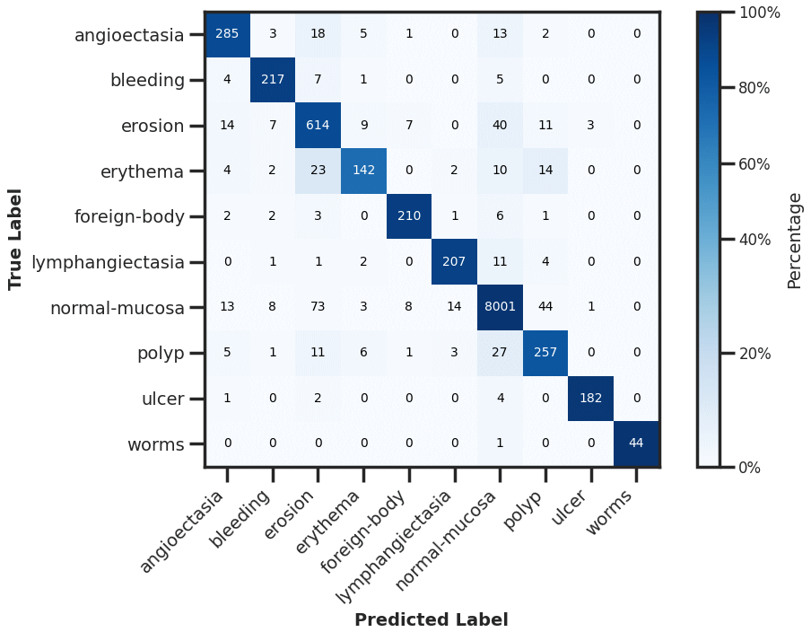

# Domain-Adaptive Pre-training of Self-Supervised Foundation Models for Medical Image Classification in Gastrointestinal Endoscopy


**Authors:** Marcel Roth, Micha V. Nowak, Dr. Adrian Krenzer, Prof. Dr. Frank Puppe

## Table of Content
- [Abstract](#abstract)
- [EndoExtend24](#endoextend24)
- [Evaluation Results](#evaluation-results)
- [Usage](#usage)
  - [Requirements](#requirements)
  - [Download Capsule Vision Challenge 2024 Dataset](#download-capsule-vision-challenge-2024-dataset)
  - [Download Pre-trained Model Weights](#download-pre-trained-model-weights)
  - [Final Directory Structure](#final-directory-structure)
  - [Fine-tune on Capsule Vision Challenge 2024 Dataset](#fine-tune-on-capsule-vision-challenge-2024-dataset)
  - [Inference on Capsule Vision Challenge 2024 Test Set](#inference-on-capsule-vision-challenge-2024-test-set)
- [Citation](#citation)
- [License](#license)


## Abstract
Video capsule endoscopy has transformed gastrointestinal endoscopy (GIE) diagnostics by offering a non-invasive method for capturing detailed images of the gastrointestinal tract, enabling early disease detection. However, its potential is limited by the sheer volume of images generated during the imaging procedure, which can take anywhere from 6-8 hours and often produce up to 1 million images, necessitating automated analysis. Additionally, the variability of these images, combined with the need for expert annotations and the scarcity of large, high-quality labeled datasets, constrains the effectiveness of current medical image analysis models. To address this, we introduce a novel large gastrointestinal endoscopy dataset, called EndoExtend24, created by merging and re-stratifying the train/test splits of ten existing public and private datasets, ensuring no overlap of patient data across splits. EndoExtend24 includes over 226,000 labeled images, as well as dynamic class mappings, which allow unified training across datasets with differing labeling granularity, supporting up to 123 distinct pathological findings. Further, we propose to leverage domain adaptive pre-training of foundation models in computer vision trained with self-supervision on generic image data, to adapt them to the task of GIE medical diagnosis. Specifically, the EVA-02 model, which is based on the vision transformer architecture and was trained on ImageNet-22k with masked image modeling (using EVA-CLIP as a MIM teacher), is pre-trained on the novel EndoExtend24 dataset to achieve domain adaptation, and finally trained on the Capsule Endoscopy 2024 Challenge dataset. Experimental results demonstrate strong performance with an F1 score of **0.88**, an improvement of about **39%** over the baseline model's F1 score of **0.49**. This substantial improvement can be attributed to the fact that the baseline models are relatively primitive compared to the state-of-the-art (SOTA) models employed in our approach. Additionally, the model achieved a macro AUC score of **0.993** and a balanced accuracy of **89.3%**.


---

# EndoExtend24
We introduce **EndoExtend24**, a large-scale,
multi-class GIE dataset comprising over 226,000 labeled images sourced from ten public and private datasets. EndoExtend24 is designed to support deep learning research in GIE by overcoming issues related to _data scarcity_, _inconsistent terminology standards_, _data leakage_ and _split flexibility_. Dataset characteristics are as follows:

<p align="center">
   
</p>

For the **Capsule Endoscopy 2024 Challenge**, we leveraged our flexible class mapping feature and created a specific **EndoExtend24** subset for our pre-training. This subset includes approximately 130,000 labeled images across 10 classes. The additional **EndoExtend24** dataset significantly increases the number of samples in the `bleeding`, `ulcer`, and `polyp` classes. Moreover, we added 201 samples to the rare `worms` class, sourced from the ERS dataset.

<p align="center">
   
</p>

---

## Evaluation Results
We present the performance of our final eva02-base model after pre-training and during the downstream task of training on CE24. These results are compared to our best baseline model during pre-training, as well as the baseline results reported by the CE24 team for various architectures. Accuracy (Acc) refers to balanced accuracy, while F1, AUC, and mAP are reported as macro averages.

<div align="center">
<table style="width:100%; border-collapse: collapse;">
  <thead>
    <tr>
      <th></th>
      <th>Model</th>
      <th>Acc</th>
      <th>macro AUC</th>
      <th>macro F1</th>
      <th>macro mAP</th>
    </tr>
  </thead>
  <tbody>
    <tr>
      <td rowspan="2"><strong>Pre-Training</strong></td>
      <td>eva02-base</td>
      <td><strong>0.810</strong></td>
      <td><strong>0.976</strong></td>
      <td><strong>0.786</strong></td>
      <td><strong>0.860</strong></td>
    </tr>
    <tr>
      <td>SEER</td>
      <td>0.743</td>
      <td>0.960</td>
      <td>0.723</td>
      <td>0.755</td>
    </tr>
    <tr>
      <td rowspan="5"><strong>Downstream</strong></td>
      <td>eva02-base <em>(ours)</em></td>
      <td><strong>0.893</strong></td>
      <td><strong>0.993</strong></td>
      <td><strong>0.875</strong></td>
      <td><strong>0.931</strong></td>
    </tr>
    <tr>
      <td>VGG16</td>
      <td>0.568</td>
      <td>0.916</td>
      <td>0.484</td>
      <td>0.525</td>
    </tr>
    <tr>
      <td>SVM</td>
      <td>0.410</td>
      <td>0.940</td>
      <td>0.490</td>
      <td>N/A</td>
    </tr>
    <tr>
      <td>ResNet50</td>
      <td>0.320</td>
      <td>0.871</td>
      <td>0.370</td>
      <td>N/A</td>
    </tr>
    <tr>
      <td>Custom CNN</td>
      <td>0.100</td>
      <td>N/A</td>
      <td>0.090</td>
      <td>N/A</td>
    </tr>
  </tbody>
</table>
</div>

<p align="center">
   
</p>
<p align="center">
   
</p>


---
## Usage
**1) Clone the repository:**
```bash
git clone git@github.com:mvnowak/cv2024.git cv2024
cd cv2024
```
- **Note:** We have organized the repository so that everything should be run from the root ("cv2024") directory

-------------------
### Requirements

-------------------

**2) Create a virtual environment:**
```bash
python3.11 -m venv venv
source venv/bin/activate
```
- **Note:** Use python version 3.11

**3) Install PyTorch:**
```bash
pip3 install torch torchvision torchaudio --index-url https://download.pytorch.org/whl/cu121
```
- **Note:** Use pytorch version 2.4.0+cu121

**4) Install the required packages:**
```bash
pip install -r requirements.txt
```

-------------------
### Download Capsule-Vision Challenge 2024 Dataset

-------------------


**5) Download Capsule-Vision Challenge
   2024 Dataset ([GitHub](https://github.com/misahub2023/Capsule-Vision-2024-Challenge?tab=readme-ov-file)):**
1. **Train and Validation** Dataset ([Link](https://figshare.com/articles/dataset/Training_and_Validation_Dataset_of_Capsule_Vision_2024_Challenge/26403469?file=48018562))
2.  **Test** Dataset ([Link](https://figshare.com/articles/dataset/Testing_Dataset_of_Capsule_Vision_2024_Challenge/27200664?file=49717386))
- **Note:** By downloading any of the datasets you agree to the terms of their use.
- Store the dataset in the `data/` directory **in the repository root** and make sure to have the following structure:
   ```
    data/
    ├── capsulevision/
    │   ├── training/
    │   │   ├── Angioectasia/
    │   │   │   ├── KID/
    │   │   │   │   ├── angioectasia-P0-1.jpg
    │   │   │   │   ├── ...
    │   │   │   ├── KVASIR/
    │   │   │   │   ├── 04a78ef00c5245e0_888.jpg
    │   │   │   │   ├── ...
    │   │   │   ├── SEE-AI/
    │   │   │   │   ├── image00279.jpg
    │   │   │   │   ├── ...   
    │   ├── validation/
    │   │   ├── ...
    │   ├── testing/
    │   │   ├── Images
    │   │   │   ├── 00Z0Xo99wp.jpg
    │   │   │   ├── ...
   ```
  - The dataset can now be found at: ```data/capsulevision```

-------------------
### Download Pre-trained Model Weights

------------------- 

You can find the weights for both the pre-trained model and the fine-tuned downstream task model below. For an easy
download on a linux cluster such as slurm, you can use the `gdown` command as shown below.

| **Type**    | **Dataset**  | **Checkpoint**                                                                                                            | **Command**                               |
|-------------|--------------|---------------------------------------------------------------------------------------------------------------------------|-------------------------------------------|
| Pre-trained | EndoExtend24 | [eva02_base_patch14_224.pt_ee24](https://drive.google.com/file/d/1Ok58RCRvKdq1_VcFn35FQOHyznvq8JFr/view?usp=sharing)      | `gdown 1Ok58RCRvKdq1_VcFn35FQOHyznvq8JFr` |
| Fine-tuned  | CE24         | [eva02_base_patch14_224.ee24_ft_ce24](https://drive.google.com/file/d/123TjuBw-34bKXBu7njzKjbcObNXsnuEY/view?usp=sharing) | `gdown 123TjuBw-34bKXBu7njzKjbcObNXsnuEY` |

**5) Download Pre-Trained EndoExtend24 Model Weights:**
- If not yet existent, create the `pretrained_models/` directory **in the repository root**
- Use the ``gdown`` package to download the checkpoint file:
```bash
mkdir pretrained_models
cd pretrained_models
gdown 1Ok58RCRvKdq1_VcFn35FQOHyznvq8JFr
```
- The checkpoint file can now be found at: ```pretrained_models/eva02_base_patch14_224.pt_ee24.ckpt```

-------------------
### Final Directory Structure

-------------------

**6) Verify the repository root folder structure:**
```
.
├── assets/
├── checkpoints/
├── configs/
├── data/
├── datasets/
│   ├── ce24/
│   │   ├── class_mapping.json
│   │   ├── train_val.csv
│   │   ├── test.csv
├── pretrained_models/
│   ├── eva02_base_patch14_224.pt_ee24.ckpt
│   ├── ...   
├── slurm/
├── src/
├── submission/
│   ├── predictions.xlsx
├── .gitignore
├── infer.py
├── README.md
├── requirements.txt
├── train.py
```

-------------------
### Fine-tune on Capsule Vision Challenge 2024 Dataset

-------------------

**7) Fine-tune the pre-trained EndoExtend24 model on CE24 by running:**
- **Required:** The fine-tuning requires a wandb project to be setup. Thus, you must replace `<WANDB_PROJECT>` and `<WANDB_ENTITY>` within the `run_eva02_base_patch14_224.ee24_ft_ce24.yaml` config with your wandb parameters.
```bash
python train.py --config configs/submission/run_eva02_base_patch14_224.ee24_ft_ce24.yaml
```
- **Note:** The training script will automatically save the best model checkpoint in the `checkpoints/` directory
- **Optional:** You can also batch the training on a slurm cluster:
```bash
python slurm/train.py configs/submission/run_eva02_base_patch14_224.ee24_ft_ce24.yaml <gpu_type>
```
- **Note**: When running on slurm you first have to check the `slurm/train.py` script and change the gpu types. You must select a valid gpu type (integer). You can attach to log output with the '-a' flag.

-------------------
### Inference on Capsule Vision Challenge 2024 Test Set

-------------------
- The `infer.py` script can be used to run inference either with a self trained or the provided checkpoint.
- **Note:** The inference script must be run from the **repository root**. 
- **Note:** We use the **same** config for inference that was used for fine-tuning. 
- Command line arguments:
  - `--config` Path to configuration file that was used to train the model checkpoint (e.g., `configs/run_eva02_base_patch14_224.ee24_ft_ce24.yaml`)
  - `--save_dir` Directory to save the prediction.xlsx file (default: `./submission/`)
  - `--checkpoint_filename` Name of the checkpoint file (e.g., `eva02_base_patch14_224.ee24_ft_ce24.ckpt`)
  - `--dataset_path` Path to the directory that contains the `capsulevision` directory (e.g., `./data/`)
  - `--dataset_csv_path` Path to the test.csv file (e.g., `./datasets/ce24`)
  - `--pretrained_checkpoint_dir` Path to the directory that contains the pre-trained checkpoint (e.g., `./pretrained_models/`)
  - `--val_bs` Batch size for validation (default: `32`)


**8a) Run Inference with self trained checkpoint:**
  - **Required:** You must refactor the ``--dataset_path <DATASET_PATH>`` to your actual data directory.
  - **Required:** You must refactor the ``--pretrained_checkpoint_dir <PRETRAINED_CHECKPOINT_DIR>`` to the directory where the checkpoint has been stored. Usually a directory with a run-name that was automatically generated by wandb, with the checkpoint file located in it (e.g., `checkpoints/<RUN_NAME>/`, trained models are usually stored in `checkpoints`).
  - **Required:** You must refactor the ``--checkpoint_filename <CHECKPOINT_FILENAME>`` to the name of the checkpoint file.
  - _Optional:_ Increase the batch size with ``--val_bs <BATCHSIZE>`` to speed up inference.

Run the following command for inference:

```bash
python infer.py --config configs/submission/run_eva02_base_patch14_224.ee24_ft_ce24.yaml --dataset_path <DATASET_PATH> --dataset_csv_path ./datasets/ce24 --pretrained_checkpoint_dir <PRETRAINED_CHECKPOINT_DIR> --checkpoint_filename <CHECKPOINT_FILENAME> --val_bs 32
```

---

**8b) Run Inference with the provided checkpoint:**
- **Required:** Make sure that the provided fine-tuned [checkpoint](https://drive.google.com/file/d/123TjuBw-34bKXBu7njzKjbcObNXsnuEY/view) is downloaded and stored in the `./pretrained_models/` directory.
- **Required:** Make sure that the `training` directory is downloaded and placed within `data/capsulevision` in the **repository root**.
- **Required:** Refactor the `--dataset_path <DATASET_PATH>` so that it matches your actual data directory.
- **Note:** You (usually) do not have to change the other arguments.
- _Optional:_ Increase the batch size with `--val_bs <BATCHSIZE>` to speed up inference.

Run the following command for inference:

```bash
python infer.py --config configs/submission/run_eva02_base_patch14_224.ee24_ft_ce24.yaml --dataset_path <DATASET_PATH> --dataset_csv_path ./datasets/ce24 --pretrained_checkpoint_dir ./pretrained_models/ --checkpoint_filename eva02_base_patch14_224.ee24_ft_ce24.ckpt --val_bs 32
```


---
## Citation

Please using the following citations for citing our work.

```bibtex
@article{roth2024domainadaptive,
      title={Domain-Adaptive Pre-training of Self-Supervised Foundation Models for Medical Image Classification in Gastrointestinal Endoscopy}, 
      author={Marcel Roth, Micha V. Nowak, Dr. Adrian Krenzer, Prof. Dr. Frank Puppe},
      year={2024},
      eprint={2410.21302},
      archivePrefix={arXiv},
      primaryClass={cs.CV},
      url={https://arxiv.org/abs/2410.21302}, 
}
```

## License

This project is licensed under the [Creative Commons Attribution-NonCommercial 4.0 International License](LICENSE).
